# DE&I Horizontal Infrastructure PMO Dashboard

A portfolio-grade **Project Management Office (PMO)** delivery dashboard for the
**Defence Estate & Infrastructure (DE&I)** horizontal infrastructure programme —
**141 projects** across **nine NZDF bases**, spanning water, wastewater,
stormwater, power, ICT, and roading.

Built as a public demonstration of large-scale government infrastructure control:
**on time, on budget, and in full** — using Earned Value Management (EVM), a
5×5 risk matrix, and executive RAG reporting.

> **Security & copyright (read first):** Publishing this demo — and referencing
> the publicly released DE&I tactical dashboard reports — does **not** violate
> NZSIS protective security rules. You **must** still respect **Crown Copyright**
> and never use NZDF/government emblems as endorsement. Full guidance:
> [Security, Copyright & Attribution](#security-copyright--attribution).
>
> The live Streamlit UI captions every view with:
> *Sourced from publicly available Official Information Act (OIA) release
> OIA-2025-5483. © Crown Copyright.*

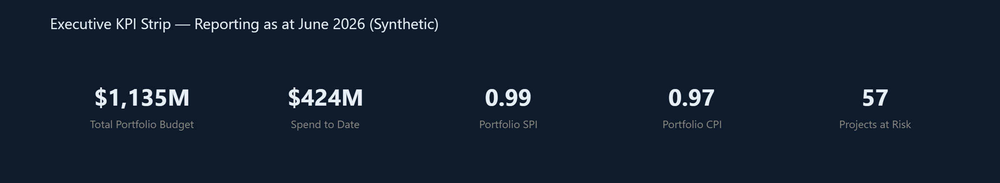

*Synthetic portfolio KPIs · reporting as at June 2026 · not actual NZDF delivery data*

---

## Table of contents

1. [Why this exists](#why-this-exists)
2. [Live demo — what you get](#live-demo--what-you-get)
3. [Portfolio snapshot](#portfolio-snapshot)
4. [Architecture](#architecture)
5. [Data pipeline](#data-pipeline)
6. [EVM methodology](#evm-methodology)
7. [Chart gallery](#chart-gallery)
8. [Quickstart](#quickstart)
9. [Repository layout](#repository-layout)
10. [Security, Copyright & Attribution](#security-copyright--attribution)
11. [Factual basis & disclaimer](#factual-basis--disclaimer)
12. [License](#license)

---

## Why this exists

This repository is a **systems-thinking / financial-control portfolio piece** for
roles such as DE&I Projects Officer. It shows how a horizontal infrastructure
PMO can:

| Capability | How it shows up in the app |
|---|---|
| Portfolio visibility | 141-project filterable register across 9 bases × 6 domains |
| Schedule & cost control | SPI / CPI from monthly PV · EV · AC ledgers |
| Risk governance | Likelihood × consequence matrix with High / Extreme register |
| Executive storytelling | KPI strip, priority mix, at-risk top-15, burndown envelope |
| Zero onboarding lag | Seeded mock data + one-command Streamlit launch |

Portfolio **shape** (counts, bases, domains, priority split) reflects published
parameters from the **2025 Defence Estate Portfolio Plan (DEPP)**. All schedule,
cost, performance, and risk **figures are synthetic**.

---

## Live demo — what you get

| Tab | Purpose | Primary artefacts |
|---|---|---|
| **Executive Overview** | Board / SLT glance | Budget, spend-to-date, SPI, CPI, at-risk count, priority bars, budget-by-base, top-15 register |
| **Risk Management** | Assurance & escalation | 5×5 heat map, zone banding, High & Extreme register |
| **Financial & Schedule** | Delivery control | Top-10 Gantt, burndown envelope, per-project EVM table |

Sidebar filters: **base locations**, **priority**, and **reporting month (as at)**.

---

## Portfolio snapshot

### Shape (DEPP 2025 parameters)

| Metric | Value |
|---|---|
| Total projects | **141** |
| Critical / High / Medium / Low | **24 / 45 / 44 / 28** |
| Medium + Low (DEPP “Medium-Low” band) | **72** |
| NZDF bases | Devonport, Whenuapai, Papakura, Waiouru, Linton, Burnham, Ohakea, Trentham, Woodbourne |
| Domains | Water, Wastewater, Stormwater, Power, ICT, Roading |
| Synthetic portfolio envelope | **~$1,135 M** |
| Mean SPI / CPI (seeded) | **0.991 / 0.975** |

### Priority mix

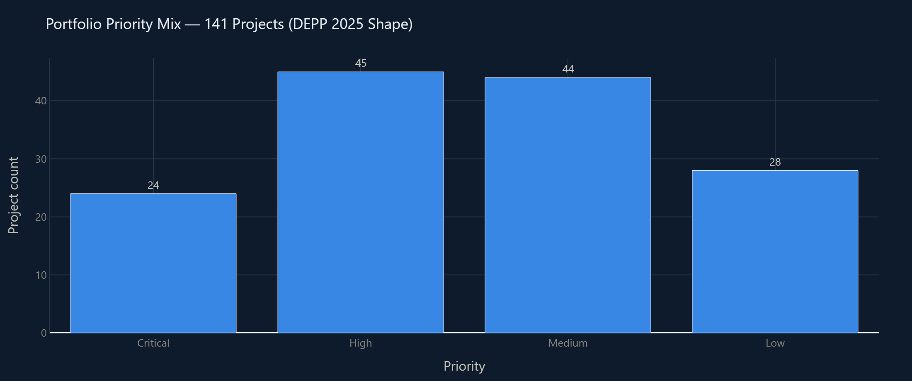

### Budget by base

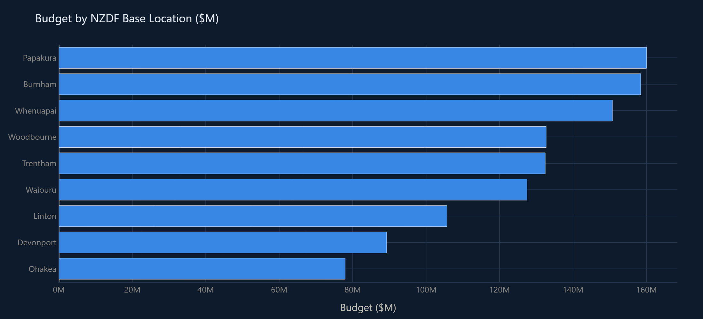

### Budget share by domain

| Domain | Projects | Budget ($M) |
|---|---:|---:|
| Power | 26 | 254.1 |
| Water | 29 | 221.6 |
| Wastewater | 24 | 203.6 |
| Roading | 25 | 198.4 |
| Stormwater | 19 | 139.0 |
| ICT | 18 | 118.2 |
| **Total** | **141** | **1,134.8** |

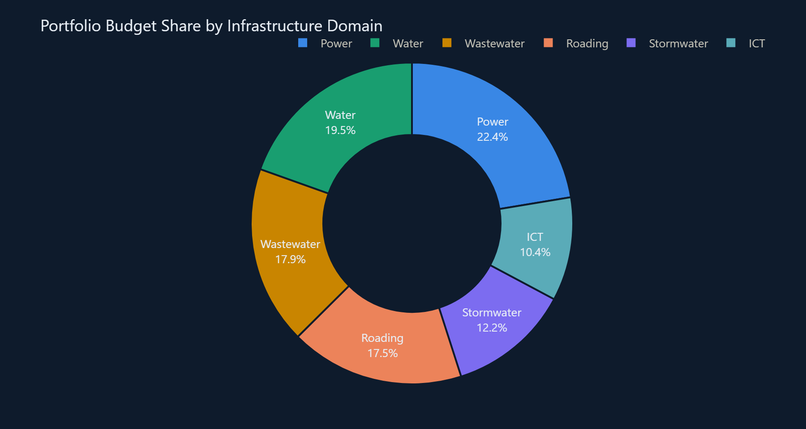

### Delivery RAG (synthetic)

| Status | Count |
|---|---:|
| On Track | 52 |
| At Risk | 51 |
| Complete | 32 |
| Behind | 6 |

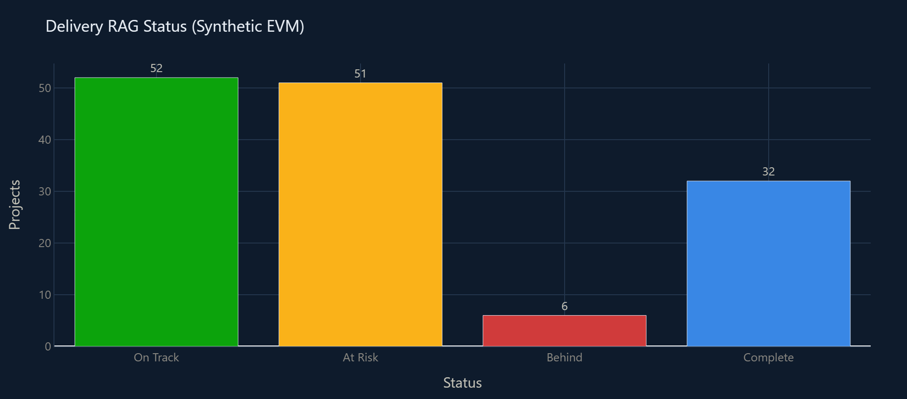

### Named example projects (pinned in generator)

| Project | Base | Domain | Priority | Budget ($M) |
|---|---|---|---|---:|
| Devonport HV Electrical Upgrade | Devonport | Power | Critical | 42.0 |
| Waiouru Wastewater Network | Waiouru | Wastewater | Critical | 28.5 |
| Papakura Potable Water Network | Papakura | Water | High | 12.8 |
| Whenuapai Stormwater Network | Whenuapai | Stormwater | High | 9.6 |

---

## Architecture

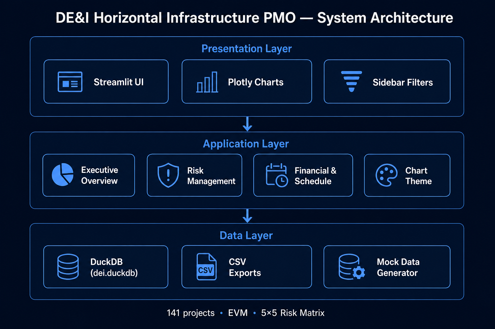

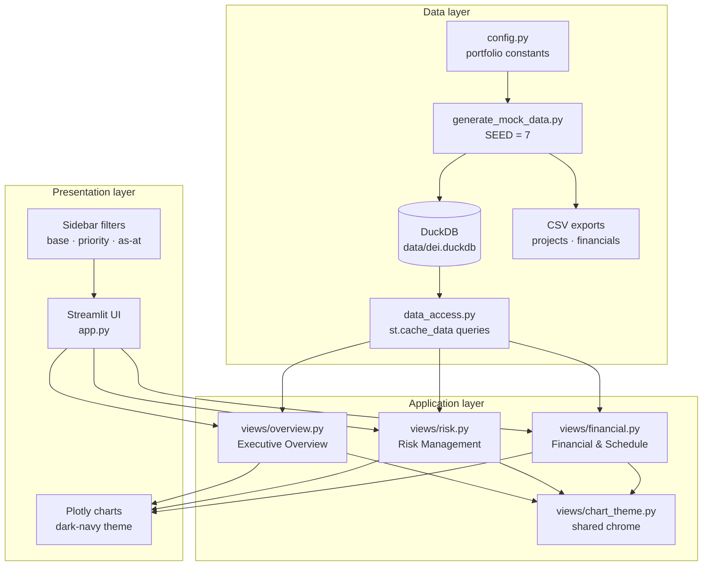

### Design choices

| Choice | Rationale |
|---|---|
| **DuckDB** | Single-file analytical store; fast local SQL without a server |
| **Streamlit** | Rapid PMO demo surface; wide layout + native metrics |
| **Plotly** | Interactive Gantt, heat map, burndown for interview walkthroughs |
| **Seeded RNG (`SEED=7`)** | Reproducible mock ledger for demos and screenshots |
| **Dark navy surface `#0e1b2c`** | High-contrast executive look; validated chart palette in `config.py` |

---

## Data pipeline

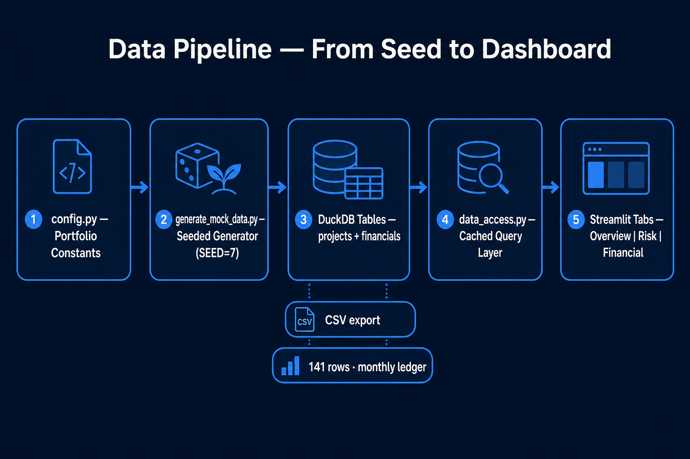

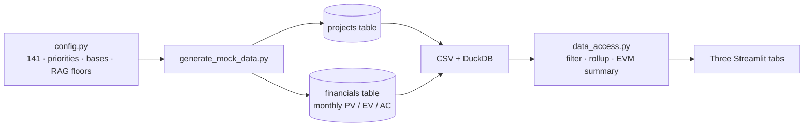

1. **Constants** (`config.py`) lock portfolio shape, RAG floors, risk banding, and palette.
2. **Generator** builds 141 projects (four named DEPP examples pinned) plus a monthly financial ledger through the reporting window.
3. **Access layer** caches DuckDB reads, applies sidebar filters, masks actuals after the as-at month, and computes SPI / CPI.
4. **Views** render KPI cards, Plotly figures, and styled registers.

Regenerate anytime:

```powershell
python generate_mock_data.py
```

---

## EVM methodology

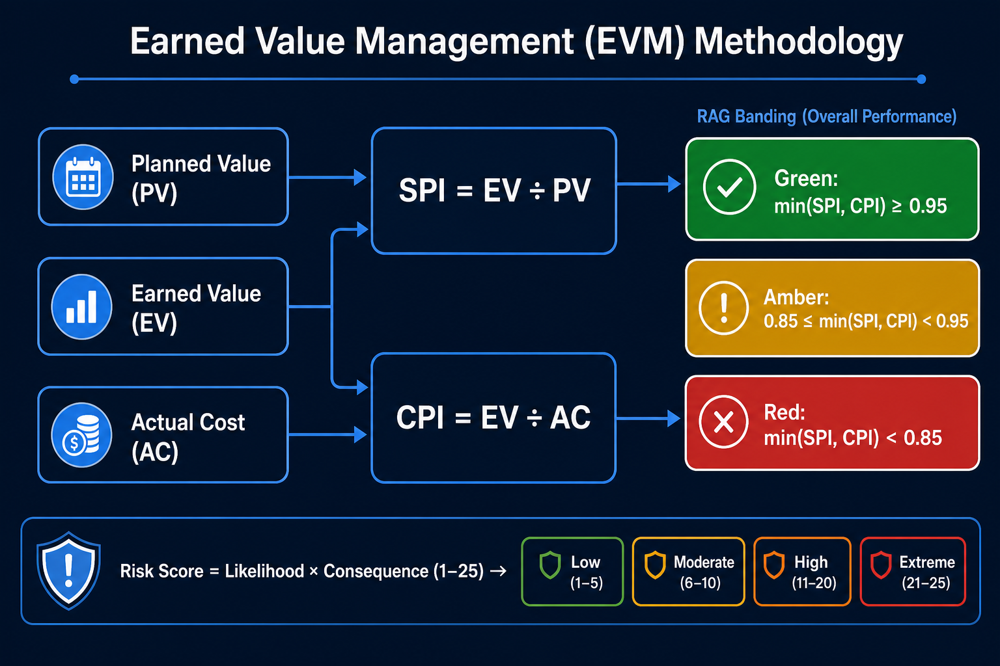

Monthly ledger columns per project:

| Field | Meaning |
|---|---|
| **Planned Value (PV)** | Budgeted cost of work scheduled |
| **Earned Value (EV)** | Budgeted cost of work performed |
| **Actual Cost (AC)** | Cost incurred |

Derived indices:

\[
\mathrm{SPI} = \frac{\mathrm{EV}}{\mathrm{PV}} \qquad
\mathrm{CPI} = \frac{\mathrm{EV}}{\mathrm{AC}}
\]

RAG status uses \(\min(\mathrm{SPI}, \mathrm{CPI})\):

| Band | Threshold |
|---|---|
| Green — On Track | ≥ **0.95** |
| Amber — At Risk | ≥ **0.85** and &lt; 0.95 |
| Red — Behind | &lt; **0.85** |

### Risk banding

\(\text{Risk score} = \text{Likelihood} \times \text{Consequence}\) (each 1–5 → score 1–25):

| Zone | Score ceiling | Colour |
|---|---:|---|
| Low | ≤ 4 | Green |
| Moderate | ≤ 9 | Amber |
| High | ≤ 16 | Orange |
| Extreme | ≤ 25 | Red |

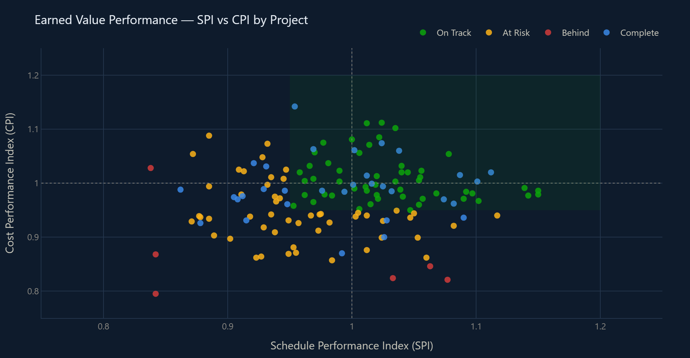

---

## Chart gallery

All figures below are exported from the **same synthetic dataset** shipped in
`data/csv/` (seed 7). Labels are spell-checked; no NZDF logos or government
emblems are used.

### 5×5 risk matrix

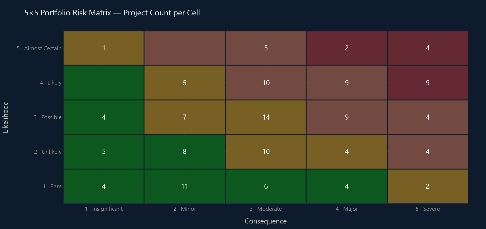

| Risk zone | Projects (full portfolio) |
|---|---:|
| Low | 42 |
| Moderate | 43 |
| High | 41 |
| Extreme | 15 |

### Top-10 Gantt

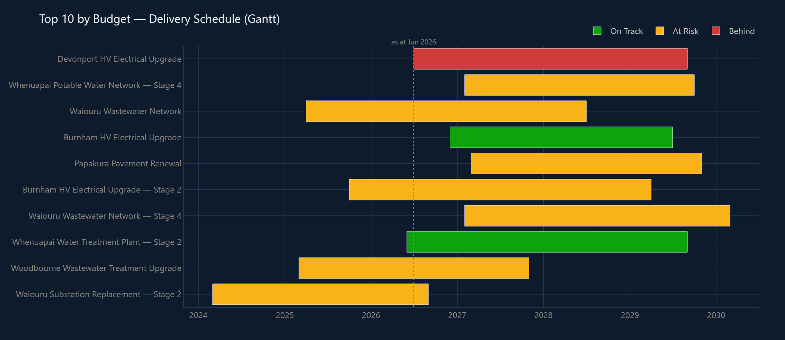

### Budget burndown

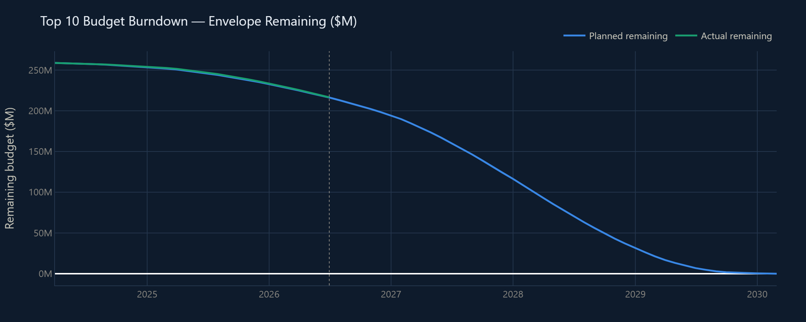

---

## Quickstart

### Requirements

- Python **3.11+** recommended
- Dependencies in `requirements.txt`

```powershell
cd dei-pmo-dashboard
python -m venv .venv
.\.venv\Scripts\Activate.ps1
pip install -r requirements.txt
python generate_mock_data.py
streamlit run app.py
```

Then open the local URL Streamlit prints (typically `http://localhost:8501`).

### Optional — regenerate README chart PNGs

```powershell
pip install kaleido
python scripts/export_readme_assets.py
```

---

## Repository layout

```
dei-pmo-dashboard/
├── app.py                      # Streamlit entry — filters + tabs
├── config.py                   # Portfolio shape, RAG/risk, palette
├── data_access.py              # DuckDB queries + EVM helpers
├── generate_mock_data.py       # Seeded mock generator
├── requirements.txt
├── LICENSE                     # MIT for code; Crown notice for OIA PDFs
├── README.md
├── .streamlit/config.toml      # Dark theme
├── data/
│   └── csv/
│       ├── projects.csv
│       └── financials.csv
├── views/
│   ├── chart_theme.py
│   ├── overview.py
│   ├── risk.py
│   └── financial.py
├── scripts/
│   └── export_readme_assets.py
└── docs/
    ├── assets/                 # Hi-fidelity charts & architecture diagrams
    └── oia-reference/          # Public OIA dashboard PDFs (Crown Copyright)
        ├── dashboard-oct-2024.pdf
        ├── dashboard-jan-2025.pdf
        └── dashboard-mar-2025.pdf
```

---

## Security, Copyright & Attribution

### 1. Clear from a security & NZSIS perspective

The **New Zealand Security Intelligence Service (NZSIS)** oversees the
**Protective Security Requirements (PSR)** and the **New Zealand Information
Security Manual (NZISM)**, which govern classified and sensitive information.

The DE&I tactical dashboard reports dated **October 2024**, **January 2025**,
and **March 2025** were **officially released to the public** under the
**Official Information Act 1982** — OIA request **OIA-2025-5483**.

Because the NZDF has formally released these documents through the OIA, they are
**unclassified**. Information requiring protection has already been withheld;
the released documents are also proactively published on the public NZDF
website. **Sharing or discussing the released reports does not constitute a
security breach**, and publishing this synthetic PMO dashboard (or referencing
those public releases) does **not** violate NZSIS rulings or national security
protocols.

> **Verdict:** Based on the public OIA release pathway, you are clear from a
> security standpoint to host this portfolio demo and cite the released
> dashboard reports.

### 2. The catch — Crown Copyright still applies

Security clearance to *share* unclassified OIA material is **not** the same as
a free licence to reuse Crown works without rules.

| Topic | Rule of thumb |
|---|---|
| **Creative Commons** | Many proactive Defence / Cabinet releases use **CC BY 4.0** — copy, distribute, and display with clear Crown (NZDF) attribution. |
| **Standard Crown Copyright** | If a specific OIA pack does **not** grant CC BY, Defence Force Instructions generally require that Crown Copyright material not be used or reproduced for other purposes without prior permission of the **Chief of Defence Force**. |
| **Logos & emblems** | Do **not** use the official NZDF “Kiwi” logo or the New Zealand Government coat of arms in a way that suggests official representation or endorsement — *Flags, Emblems, and Names Protection Act 1981*. |

### 3. Portfolio hosting checklist (`reversesingularity.com` and this repo)

1. Caption any OIA-sourced dashboard image or PDF with:

   > *Sourced from publicly available Official Information Act (OIA) release
   > OIA-2025-5483. © Crown Copyright.*

2. Do **not** extract or use the NZDF logo as a standalone graphic in site or
   README design.
3. Frame the materials as **public-domain examples of the operating environment**
   you are preparing to work in (e.g. MacGyver Protocol / zero-onboarding-lag
   use cases) — **not** as an official NZDF product.
4. Keep this repo’s **synthetic** schedule, cost, and risk figures clearly
   labelled as mock data.

Copies of the three public release PDFs live in
[`docs/oia-reference/`](docs/oia-reference/) for reference only.

---

## Factual basis & disclaimer

| Layer | Source of truth |
|---|---|
| Portfolio counts, bases, domains, priority split | Published **2025 Defence Estate Portfolio Plan** parameters |
| Schedule, cost, SPI/CPI, risk scores, RAG | **Synthetic** (seeded generator) |
| Reference tactical dashboard PDFs | Public **OIA-2025-5483** release · © Crown Copyright |

**This project is not affiliated with, endorsed by, or an official product of
the New Zealand Defence Force or the New Zealand Government.**

---

## License

- **Application source code** in this repository: [MIT](LICENSE).
- **OIA reference PDFs** under `docs/oia-reference/`: **© Crown Copyright** —
  not MIT-licensed; follow the attribution rules above.

---

## Author

Portfolio demo by [reversesingularity](https://github.com/reversesingularity) ·
personal site: [reversesingularity.com](https://reversesingularity.com)
